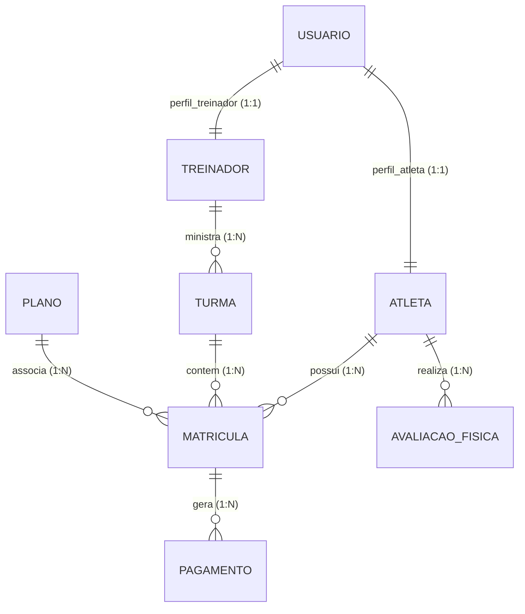

# 🥊 Iron Boxing API

[](https://spring.io/projects/spring-boot)
[](https://www.oracle.com/java/technologies/javase-jdk17-downloads.html)
[](https://www.postgresql.org/)
[](https://flywaydb.org/)
[](https://opensource.org/licenses/MIT)

API RESTful para gerenciamento administrativo, financeiro e físico de uma academia de boxe. O sistema implementa controle de acesso baseado em papéis (RBAC), autenticação stateless via tokens JWT e decisões de projeto alinhadas com boas práticas de segurança e privacidade de dados.

---

## 🛠️ Tecnologias e Arquitetura

* **Java 17 & Spring Boot 3.4.0**
* **Spring Security**: Controle de acesso corporativo e autenticação stateless.
* **JSON Web Token (JWT)**: Transmissão segura de claims entre cliente e servidor.
* **Spring Data JPA & Hibernate**: Camada de persistência relacional com validação estática de schema.
* **Flyway Migration**: Versionamento e evolução controlada do banco de dados PostgreSQL.
* **Jakarta Bean Validation**: Garantia de integridade de dados na camada de transporte (DTO/Entities).
* **OpenAPI 3 / Swagger UI**: Documentação interativa em português estruturada sob o padrão OpenAPI.

---

## 🔒 Decisões de Projeto e Segurança

### 1. Defesa contra Username Enumeration (Conformidade LGPD)
Para inviabilizar ataques de reconhecimento de contas ativas (*username enumeration* via força bruta), os fluxos de criação e atualização de contas empregam uma estratégia de resposta padronizada. Em caso de colisão de dados únicos (e-mail, CPF ou telefone), a API retorna o mesmo código de status `400 Bad Request` e a mensagem idêntica: `"Erro ao salvar usuario, caso já tenha conta faça o login"`, sem indicar qual dado causou a restrição.

### 2. Autenticação Stateless e RBAC
* **Stateless**: O Spring Security foi configurado com sessão sem estado (`SessionCreationPolicy.STATELESS`), eliminando o uso de cookies ou controle de sessão no servidor e permitindo escalabilidade horizontal.
* **RBAC (Role-Based Access Control)**: Cada requisição é interceptada por um filtro que decodifica as permissões do token JWT, autorizando o acesso conforme a hierarquia:
  * `ADMIN`: Acesso irrestrito a configurações de planos, turmas e gestão de contas.
  * `TREINADOR`: Gestão operacional de turmas, horários e histórico de avaliações físicas.
  * `ATLETA`: Acesso ao histórico pessoal de matrículas, pagamentos e avaliações.

### 3. Criptografia Adaptativa
As senhas de usuários são criptografadas no momento do cadastro utilizando **BCrypt** com fator de custo adaptativo, garantindo proteção contra ataques de dicionário ou tabelas arco-íris (*rainbow tables*).

---

## 📂 Modelagem de Dados

O banco de dados relacional foi estruturado para suportar a separação lógica entre dados cadastrais e perfis esportivos:



---

## 🛠️ Como Configurar e Executar

### Pré-requisitos
* **Java 17 JDK**
* **Maven 3.x**
* **PostgreSQL** instalado

### 1. Configurando Variáveis de Ambiente
O arquivo `src/main/resources/application.properties` utiliza variáveis de ambiente com valores padrão (*fallback*) para facilitar a portabilidade do projeto (Docker/CI-CD):

```properties
spring.datasource.url=${DB_URL:jdbc:postgresql://localhost:5432/academia}
spring.datasource.username=${DB_USER:seu_usuario}
spring.datasource.password=${DB_PASS:sua_senha}
spring.jpa.hibernate.ddl-auto=${JPA_DDL_AUTO:validate}
spring.flyway.baseline-on-migrate=${FLYWAY_BASELINE:true}
```

*Antes de rodar a aplicação, certifique-se de criar a base de dados `academia` localmente no PostgreSQL.*

### 2. Build e Compilação
```bash
./mvnw clean compile
```

### 3. Execução
```bash
./mvnw spring-boot:run
```

O servidor iniciará em `http://localhost:8080`.

---

## 📖 Fluxo de Uso & Exemplos Práticos

### Endpoint de Autenticação (`POST /api/usuarios/login`)

**Request Payload:**
```json
{
  "email": "popo.freitas@ironboxing.com",
  "senha": "senha_segura"
}
```

**Response Payload (JWT Token):**
```json
{
  "token": "eyJhbGciOiJIUzI1NiJ9.eyJzdWIiOiJwb3BvLmZyZWl0YXNAaXJvbmJveGluZy5jb20iLCJpYXQiOjE3MTg2NTcyMDAsImV4cCI6MTcxODY2MDgwMH0.xxxx",
  "usuario": {
    "id": 2,
    "nome": "Popó Freitas",
    "email": "popo.freitas@ironboxing.com",
    "cpf": "12345678901",
    "telefone": "11999999999",
    "endereco": "Av. dos Boxeadores, 44",
    "cep": "04001000",
    "cidade": "São Paulo",
    "estado": "SP",
    "dataNascimento": "1975-09-21",
    "genero": "M",
    "role": "TREINADOR"
  }
}
```

### Usando o Token no Swagger UI
1. Acesse `http://localhost:8080/swagger-ui/index.html`.
2. Efetue login usando a rota acima e copie o valor da propriedade `token`.
3. Clique no botão **Authorize** (cadeado no topo da página).
4. Cole o token e salve. As requisições subsequentes incluirão o cabeçalho `Authorization: Bearer <seu_token>`.

---

## 📈 Endpoints Disponíveis

| Método | Rota | Descrição | Restrição |
| :--- | :--- | :--- | :--- |
| `POST` | `/api/usuarios` | Cadastro de novos usuários | Público |
| `POST` | `/api/usuarios/login` | Login e geração de token JWT | Público |
| `GET` | `/api/usuarios` | Listagem geral de usuários | `ADMIN` |
| `GET` | `/api/usuarios/{id}` | Detalhes cadastrais de usuário | Autenticado |
| `PUT` | `/api/usuarios/{id}` | Atualização de dados cadastrais | Autenticado |
| `DELETE` | `/api/usuarios/{id}` | Exclusão definitiva de conta | `ADMIN` |
| `POST` | `/api/atletas` | Cria perfil de atleta associado a um usuário | Autenticado |
| `POST` | `/api/treinadores` | Cria perfil de treinador associado a um usuário | Autenticado |
| `GET` | `/api/planos` | Gestão de planos de cobrança | Autenticado |
| `GET` | `/api/turmas` | Listagem e horário de turmas | Autenticado |
| `GET` | `/api/matriculas` | Controle de matrículas de atletas | Autenticado |
| `GET` | `/api/pagamentos` | Fluxo financeiro e histórico de pagamentos | Autenticado |
| `GET` | `/api/avaliacoes` | Histórico físico de atletas e cálculo de IMC | Autenticado |

---

## 📝 Licença
Este projeto está sob a licença MIT. Veja o arquivo [LICENSE](LICENSE) para mais detalhes.

🥊 *Iron Boxing - Força, Disciplina e Respeito.*
